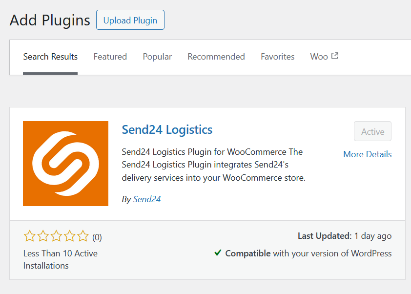

# Installation

1.  Install WooCommerce main plugin from the WordPress plugin store

    **Send24 Logistics in the Plugin Store**
    

2.  Install the Send24 plugin from the WordPress plugin store
3.  Activate the plugin through the **Plugins** menu in WordPress.
4.  Go to **WooCommerce > Settings > Shipping > Send24 Logistics** to configure your API keys and other settings.