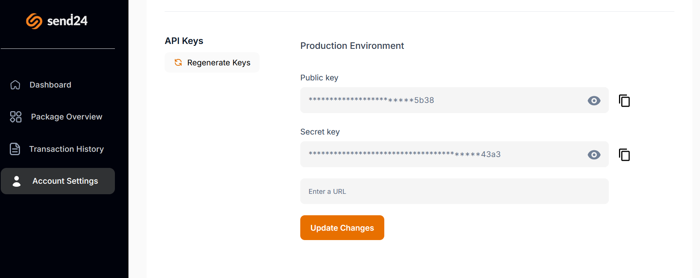

# API Keys Configuration

-   Visit the [Send24 Corporate Client Website](https://corporate.send24.com.ng)
-   Generate and manage API keys for your integration.
-   Navigate to **Signup/Sign in -> Dashboard -> Account Settings -> API Keys**.

1.  **Signup**
    
2.  **Sign In**
    

3.  **Dashboard**
    

4.  **API Keys Setting**
    