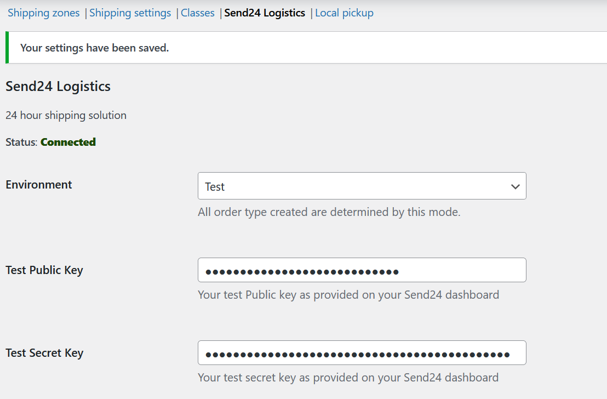
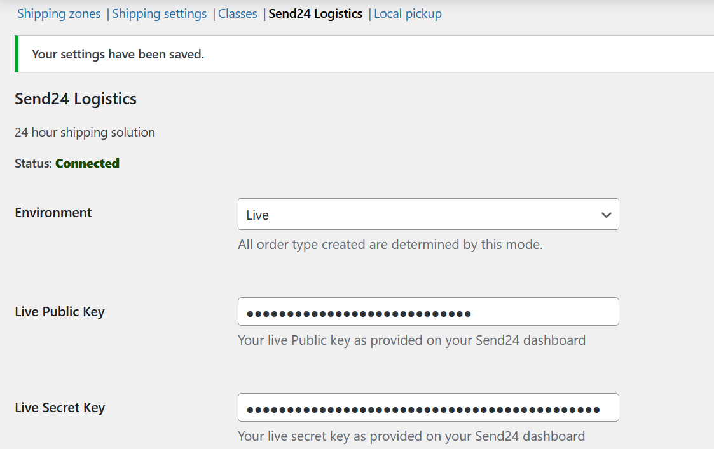

# Mode (Test/Live) Configuration

-   Navigate to **WooCommerce > Settings > Shipping > Send24 Logistics**.
-   Switch between **Test Mode** and **Live Mode** in the plugin settings.
-   Test Mode allows you to simulate delivery options without affecting real orders.
-   Save changes and test the setup using a sample order.
 
    **API Keys Setting**
   
   